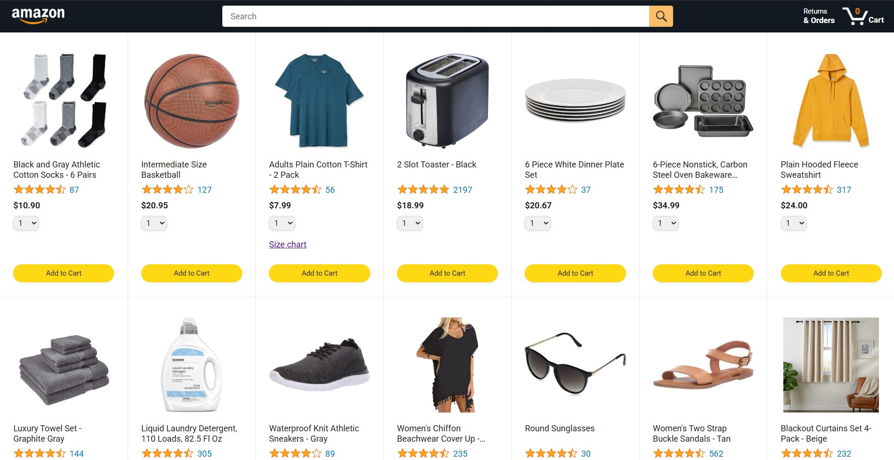
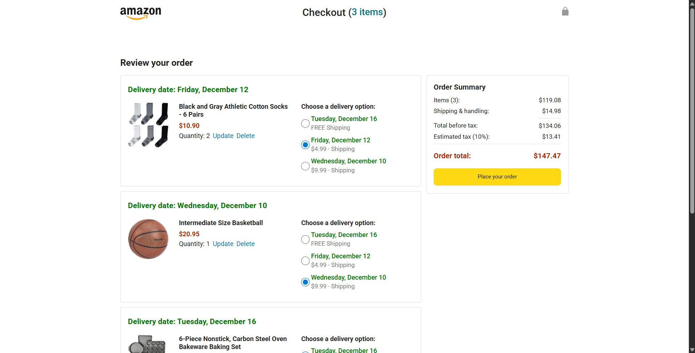

Amazon Clone – E-Commerce Website

The Amazon Clone is a fully functional e-commerce website built with **HTML, CSS, and Vanilla JavaScript**, featuring a working backend that enables real-time product rendering, and cart management.  
It replicates Amazon’s shopping experience — from browsing items to adding them to the cart and placing an order.

🔹 Features

🧭 Dynamic product listing and rendering from backend  
🛍️ Add to cart, remove, and update quantities  
⚡ Backend communication using **Fetch API** and **async/await**  
🎨 Fully responsive design built with CSS  
🧩 Organized file structure for scalability  

🔹 Tech Stack

**Frontend:** HTML, CSS, JavaScript (ES6+)  
**Backend:** JavaScript (local mock server)

🔹 Project Purpose

This project was built as a learning exercise to strengthen full-stack fundamentals, focusing on:

- Asynchronous JavaScript (fetch, promises, async/await)  
- DOM manipulation and dynamic UI updates  
- Styling and responsive layout techniques  
- Basic backend and API integration  

It also serves as a strong foundation for expanding into a **full-stack e-commerce platform** in the future.

🔹 Getting Started

**Clone the repository**

git clone https://github.com/AryanSharma48/amazon-clone.git
Navigate into the project folder

Copy code
cd amazon-clone

Copy code
Open the project
Simply open the index.html file in your browser or use Live Server in VS Code. 🚀

🔹 Screenshots

**Homepage**

**Checkout Page**

🔹 Future Improvements

- ✅ Integrate database (MongoDB / Firebase) for persistent storage  
- ✅ Add search and filter options for products  
- ✅ Implement order tracking and payment gateway  
- ✅ Implement authentication and session handling  
- ✅ UI/UX refinements and animations

✨ Made with ❤️ by Aryan Sharma while learning full-stack web development.